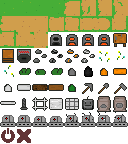
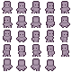

# CodeBots

*Künzli Christophe, Jouve Léonard, Schouwey Zaïd*

You can find our Codebot interpreter package [here](https://github.com/LeonardJouve/CodeBotsInterpreter)

## Livrables S1

- [X] Description du projet (objectif, requirements fonctionnels, requirements non-fonctionnels).
- [X] Description préliminaire de l’architecture
- [X] Mockups (Figma, papier-crayon, etc.) / Landing page
- [X] Description des choix techniques • Description du processus de travail (p.ex.: git flow, devops, etc.)
- [X] Mise en place des outils de développement (Issue tracker … etc.)
- [X] Mise en place d’un environnement de déploiement
- [X] Mise en place d’un pipeline de livraison et de déploiement (CI/CD)
- [ ] Démonstration du déploiement d’une modification

## 1. Description du projet

CodeBots est un petit jeu 2D vu de dessus en JavaScript où le joueur récolte des ressources et construit des robots
programmables capables d’automatiser certaines tâches (récolte, transport, stockage, fabrication). Le jeu met l’accent
sur la gestion, la programmation simple d’actions et la progression par crafting et technologies.

L'objectif final est de construire un core. Ce core nécessite une grande quantité de ressources, poussant le joueur à
automatiser la récolte et le transport de celles-ci via des robots.

Le jeu nécessite le développement d'un interpréteur simple permettant de comprendre et d'exécuter le code écrit par le
joueur pour ses robots.

### Requirements fonctionnels

- Le monde est généré procéduralement.
- Le joueur peut se déplacer et récolter des ressources (bois, pierre, etc.).
- Le joueur peut crafter des objets (outils, robots, coffres).
- Le joueur peut définir des zones et les nommer.
- Le joueur peut nommer des coffres
- Les robots peuvent recevoir des instructions (ex. séquences conditionnelles simples). Ces instructions sont
  directement données par le joueur.

Ex. 1

```
Repeat:
    go to zone 1
    cut wood
    go to chest 1
    drop wood to chest 1
```

Ex. 2

```
Repeat:
    go to chest 2
    pick birch seed
    go to zone 1
    plant birch seed
```

- Les ressources peuvent être stockées dans des coffres.
- Les technologies débloquées permettent d’améliorer les robots et outils.
- Une interface permet de gérer les robots et leurs actions.
- Créer un [interpréteur](https://github.com/LeonardJouve/CodeBotsInterpreter) simple permettant d'exécuter les actions
  du robot

### Requirements non-fonctionnels

- Jeu accessible via navigateur (client web en JS).
- Code modulaire et extensible (facile d’ajouter de nouveaux outils/robots).
- Déploiement simple via un serveur web (hébergement Netlify).

## 2. Description préliminaire de l’architecture

- Front-end :

    - Framework : PixiJS pour le rendu 2D.

    - Langage : TypeScript

- Back-end :
    - Authentification

    - Sauvegarde de la progression

- Organisation logique :

    - Core : moteur du jeu (entités, collisions, ressources).

    - AI/Robots : logique des robots et interprétation de leurs instructions.

    - UI : affichage HUD, inventaire, gestion des robots.

    - Persistence : sauvegarde locale ou en ligne

## 3. Mockup

Les mockups ont été réalisés
sur [Figma](https://www.figma.com/design/tnGuliOxWSMdlvZOj1Epsm/Game?node-id=0-1&p=f&t=2IQgDc3RoBgWTm9V-0)

Storyboards:


## 4. Description des choix techniques

- PixiJS: librairie pour gérer le rendu 2D.

- TypeScript.

- HTML/CSS pour l’UI.

- Node.js serveur de sauvegarde.

- Hono simple web framework

- GitHub pour le versioning et gestion des issues.

- CI/CD : GitHub Actions (tests + déploiement automatique).

- Déploiement : Azure Web App Service.

## 5. Description du processus de travail

- Méthodologie agile (Kanban) : tâches visibles dans GitHub Projects

- Git flow simplifié :
    - main = version stable.
    - dev = branche d’intégration.
    - développement des features sur branches spécifiques puis merge dans dev une fois que les tests passent et
      finalement merge dans main une fois que la feature est stable.
    - Push bloqués sur dev et main
    - Code reviews via pull requests.

## 6. Environnement de déploiement

### Application

2 environnements de déploiement sur Azure App Service:

- [dev](https://codebots-dev-web-app.azurewebsites.net/)
- [stable](https://codebots-stable-web-app.azurewebsites.net/)

Après un push passant les tests sur la branche associée à l'environnement, le code est automatiquement déployé.

Avec ces deux environnements, nous pouvons d'abord tester les nouvelles fonctionnalités dans l'environnement de dev
avant de les déployer dans l'environnement stable.

### Interpréteur

Nous avons choisi de développer l'interpréteur dans un [repo](https://github.com/LeonardJouve/CodeBotsInterpreter)
séparé car il pourrait être réutilisé dans d'autres projets. Nous avons aussi mis en place un pipeline CI/CD de
déploiement automatique sur [NPM](https://www.npmjs.com/package/codebotsinterpreter) après un push passant les tests sur
main.

De cette manière, nous pouvons facilement l'intégrer dans notre projet principal en tant que dépendance NPM.

## 7. Game art

La plupart des assets graphiques ont été créés par Schouwey Zaid à l'aide de [Piskel](https://www.piskelapp.com/).



Les éléments de GUI proviennent du pack
gratuit : [Tiny Wonder GUI Pack](https://butterymilk.itch.io/tiny-wonder-gui-pack).


Le personnage vient du pack gratuit : [pixelrpg](https://snoblin.itch.io/pixel-rpg-free-npc).




